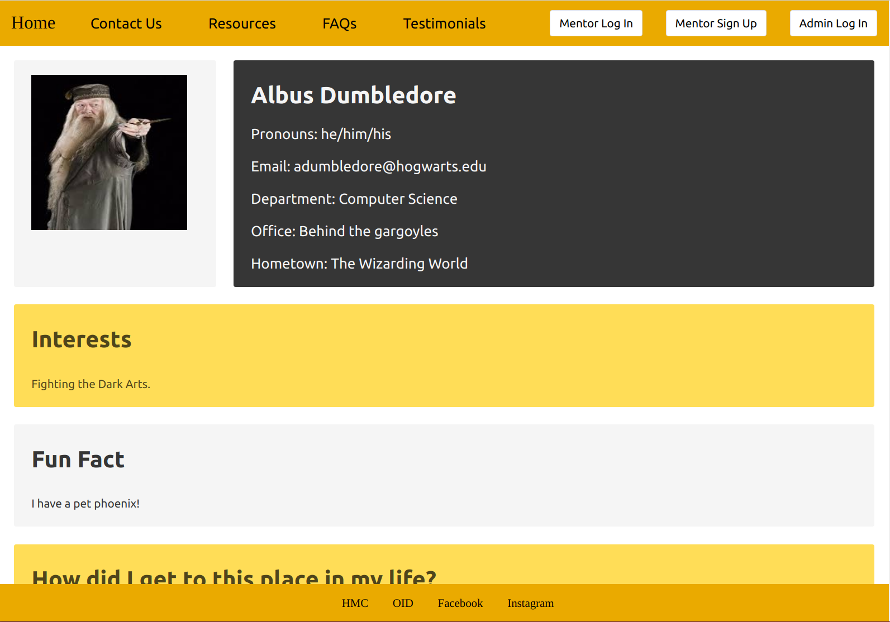

# FirstGenFacultyPage
The First-Gen Faculty Page is a website created by team Unigon for first-generation college students attending Harvey Mudd College. The website provides an easy way for first-generation students to find mentors among professors who were first-generation students themselves. The students simply have to browse our main page for a preview of all available mentors. Professors can sign up to be mentors in three simple steps: first they create an account with the website using their HMC single sign-on, then they fill out a few questions about themselves, and finally they upload a profile picture. Both professors and students can easily contact the administrators of the First Gen Faculty Page through our website.  


## Architecture

### Prerequisites
##### Ruby and Rails
This project uses Rails 5.2 and Ruby 2.3

#####  Image Processor and file
This project uses Paperclip gem which requires ImageMagick and `file` command. Installation and configuration instructions found [here](https://github.com/thoughtbot/paperclip#requirements).

### Gems
* Bulma - Used for styling the website
* Paperclip - Used for profile image uploading
* Better Errors - Used to see more descriptive errors while in development mode
* Omniauth Google Oauth2 - Used to allow professors to sign in with google
* Devise - Used for admin interface sign-on

## Installation
After prerequisites have been met, run the following commands:

Download the repo from github by running in desired directory:
```
git clone <repo>
```
Navigate into your directory through terminal and install ruby gems by running the following command:
```
bundle install
```
Finally, finish setting up the environment by running the following commands:
```
rails db:migrate
```
```
rails db:seed
```
In the ***config/application.yml*** file, add configuration values for website mailer to work. 

Lastly, to launch the website, run:
```
rails server 
```
or
```
rails s 
```

## Functionality

### Users
All users of this website will be associated with Harvey Mudd College. There are three possible users for this website: first-generation current or prospective students, first-generation professors, and the Office of Institutional Diversity (OID). The students do not need to make an account with the website. They interact with the website by viewing available professor mentors, submitting feedback, questions, or testimonials for the website and browsing through the resources available to first generation college students. Professors who were first generation college students can sign up to be mentors for the program. OID administers the website, keeps the resources up-to-date, and uploads any relevant testimonials or frequently asked questions. 


### User Journey for Student
#### Main Page
The *Main Page* for the website, pictured in Figure 2, has some basic information about the website, and an overview of all professors who are currently signed up on the site. When a student clicks on the overview of a given professor, the page redirects to that professor's profile page.


__Figure 1__
This is the *Main Page* of the website. It has a description of the website and a display of all the professors who have signed up for the site. The block labeled features will contain content that OID provides.

#### Navigation Bar
The navigation bar, pictured in Figure 3, is located at the top of the website and is accessible throughout the whole website. The student can select the "Home" button to go to the *Main Page*. The rest of the buttons will redirect the student to the pages that are described in the following sections.


__Figure 2__
The navigation bar, as can be seen from the *Main Page*

#### Profile Page
Each professor's *Profile Page*, an example of which can be seen in Figure 4, has an in-depth description that they have provided, including their picture, contact information, interests, and why they want to be a mentor. These pages allows the students to learn more about professors before contacting them. 


__Figure 3__
This is the *Profile Page* for a professor that shows basic information about an individual professor.

#### Testimonials
Students will be able to browse this page to find out more about the experiences of past participants. If a student wishes to submit their own testimonial, they click the link at the bottom of the page, as can be seen in Figure 5, which redirects them to the *Contact Us* page, from which their testimonial will be sent to OID for approval before being posted on the *Testimonials* page by OID.


__Figure 4__
An example testimonial

#### FAQs
Students can browse this page to read through some commonly asked questions and answers about the program. If a student wishes to submit a new question, they click the link at the bottom of the page, as seen in Figure 6, which redirects them to the *Contact Us* page, from which they can submit their question to OID.


__Figure 5__
An example of an FAQ.

#### Contact Us 
Students will be able to submit feedback through the *Contact Us* page which contains a form. The form allows for five types of feedback to be submitted: "Testimonial," "Question," "Private," "Feedback," "Other." This is demonstrated in Figure 7. 


__Figure 6__
Contact Us form. The drop down menu allows for the selection of one type of feedback.

All types of feedback are sent to OID's email. Students can submit their testimonials, feedback, and questions through the "Testimonials," "Feedback," and "Questions" options, respectively. Students can submit private questions or information that a student might want to alert OID about through the "Private" option. Anything else should be submitted using the "Other" option. For example, a student might want to let OID know about a resource that is not currently listed using the "Other" option.


#### Resources

The resources page has a number of resources intended for first-generation college students as seen in Figure 8. OID has provided links to resources they think would be valuable, including a number of scholarships for first-generation students. 


__Figure 7__
Resources being displayed on the page


### User Journey for Professor
 
The professors are able to access all the website pages that are available to the student users. Harvey Mudd College professors that were first generation students can sign up to be a mentor to these students by using their HMC credentials. 


#### Form Page
After signing in, the professor is directed to a form page, as can be seen in Figure 9, where they can enter all their information and upload a picture. 


__Figure 8__
Mentor sign-up for professors. The professor can either drag their picture into the box or use the upload button. The actual image is not displayed on the page. All fields apart from the picture are required to be filled. The form page asks the user to  sign up to be a mentor only if they are an HMC professor. A professor is able to edit their profile after they have completed, in which case they are redirected back to this sign-up page. Note that the picture is cropped for readability.


### User Journey for Office of Institutional Diveristy

OID will be able to access all the same pages that the students can, as well as some private forms used for maintaining the website. These forms are outlined below.

#### Admin Login
OID will be able to log in to an admin account using the admin login button, found next to the mentor login button. This will direct them to an admin login page, which can be seen in Figure 10. This gives them access to a version of the site with extra options to create testimonials, FAQs, and resources.


__Figure 9__
Admin login page. This allows OID to login to a version of the site with admin privileges.

#### Testimonial Form Page
This form page will be accessed only by OID to create new testimonials which will be displayed on the site.


__Figure 10__
The form OID will use to create a new testimonial, as can be seen in Figure ???.

#### FAQ Form Page
This form page will be accessed only by OID to create new frequently asked questions and answers, which will be displayed on the site.


__Figure 11__
The form OID will use to create a new FAQ.


#### Resources Form Page 
This form page will be accessed only by OID to post new resources which will be displayed on the site. 


__Figure 12__
Resources being displayed on the page


## Known Problems
Currently, the admin privileges provided to the Office of Institutional Diveristy (OID) are limited to editing all mentor profiles, adding new testimonials and adding new FAQs to the website. However, the administrator is not able to delete any mentor profiles, add new resources or update the overview of the program without touching our codebase.

## Contributing
1. Fork it!
2. Create your feature branch: `git checkout -b my-new-feature`
3. Commit your changes: `git commit -am 'Add some feature'`
4. Push to the branch: `git push origin my-new-feature`
5. Submit a pull request

## Credits
Contributors: Daksha Agarwal, Luis Hernandez Cruz, Chen Pekker, Nelll White

Client: Dean Zack Ritter, Diana Aguilar, OID

CS121: Yekaterina Kharitonova

## License
See LICENSE.txt
